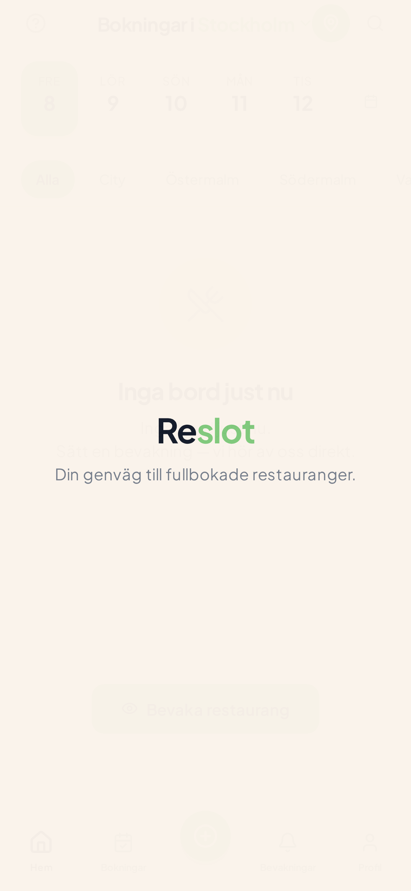
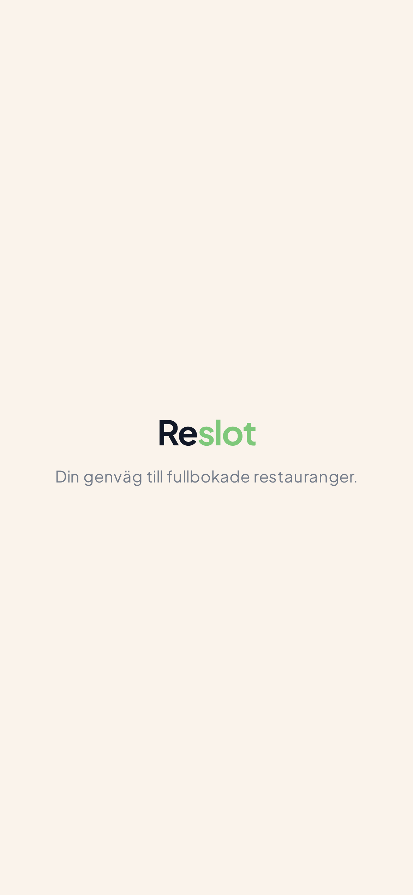
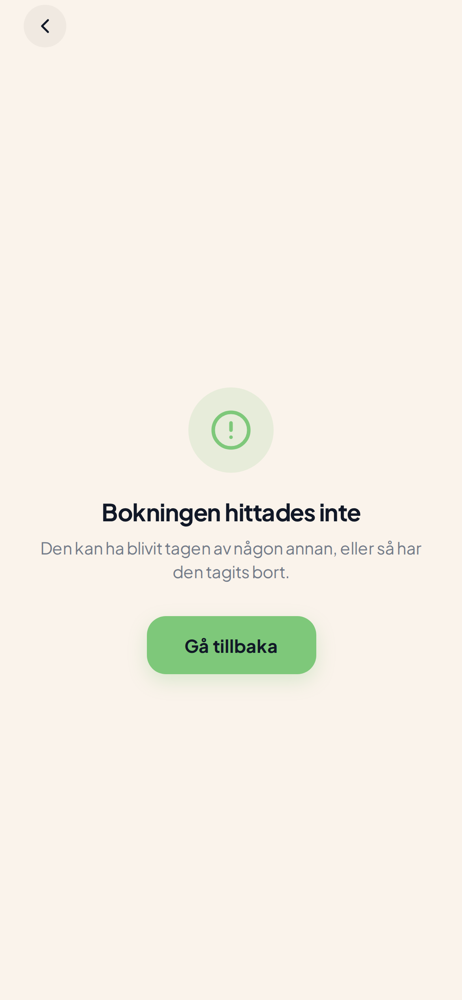
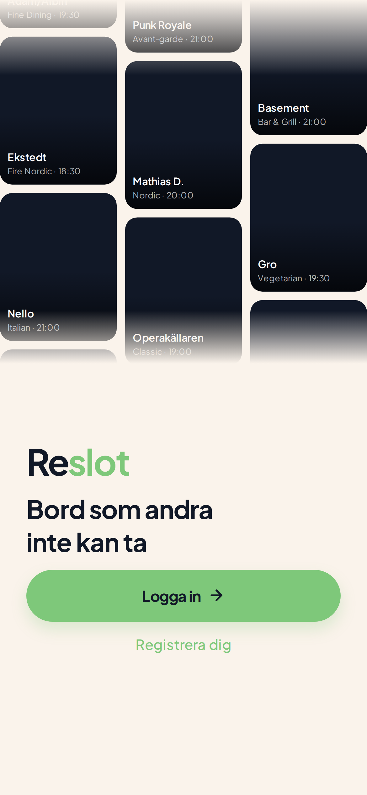
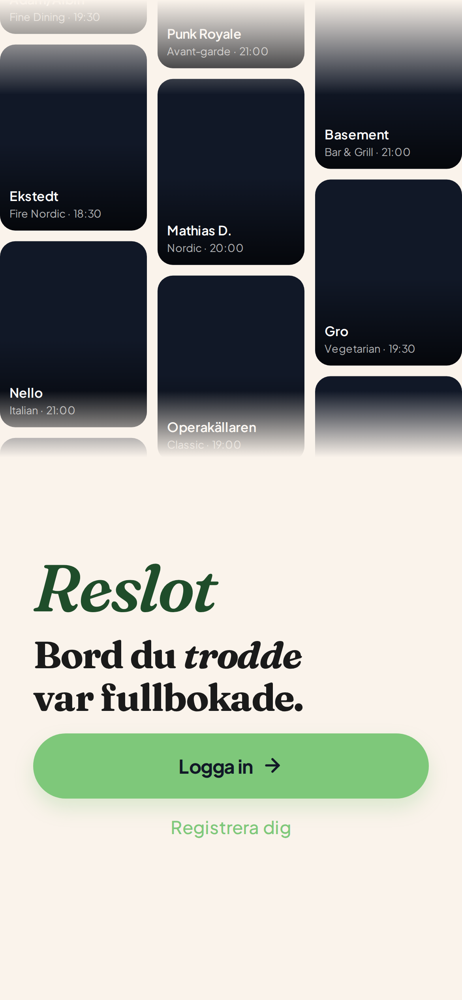
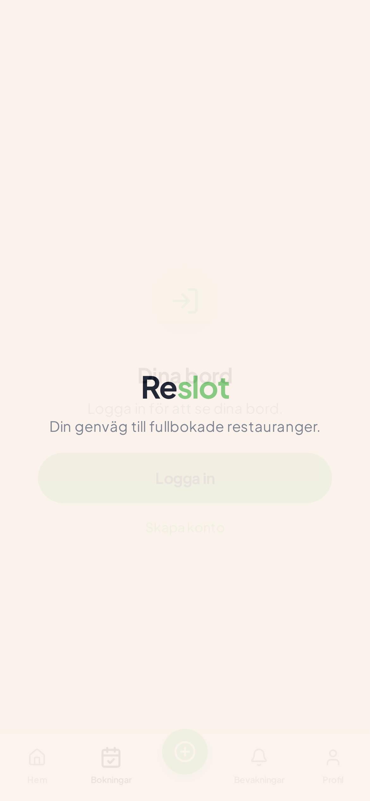
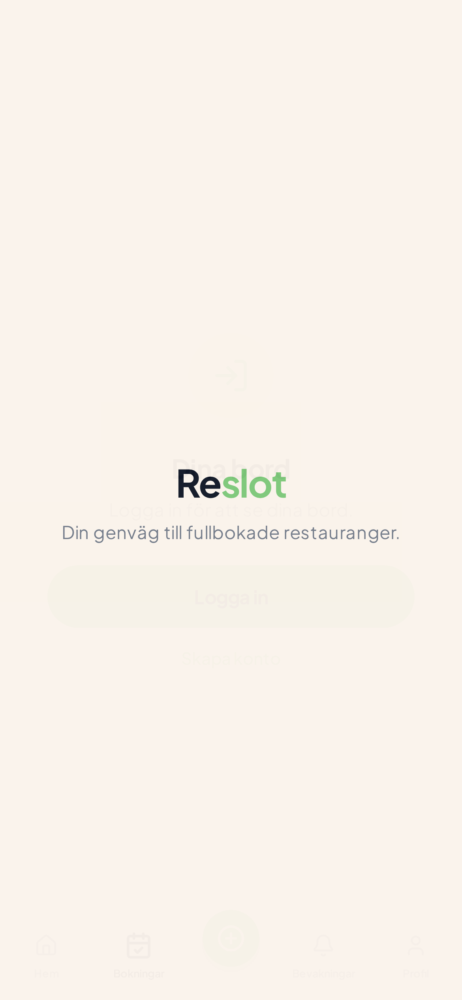

# Morning Review — Reslot Identity v2 Overhaul
**Natten 2026-05-08 → 2026-05-09 · Autonomt designjobb**

> **God morgon, William.** Här är vad som hände i natt. Hela appen är lyft till Pi-tier identity — cream + forest-green + Fraunces serif + italic-on-verb microcopy. Ingenting är pushat (push 403 utan credentials), allt är lokalt på `night/identity-overhaul-2026-05-08`.

---

## TL;DR

| Metric | Value |
|---|---|
| Skärmar redesignade | **23 av 26** (3 skipped, alla med skäl) |
| Commits på night-branch | **22** (1 setup + 8 foundation + 4 tier-1 + 8 tier-2 + 1 tier-3-batch) |
| Tokens introducerade | 14 nya (cream, forest, coral, ink, pastels) — alla legacy-tokens kvar |
| Komponenter byggda | 4 nya (`Heading`, `ReslotMark`, `TableWingsMascot`, `PhotoSlot`) |
| TypeScript errors | **6 baseline kvar** (alla pre-existing — 0 nya införda) |
| Functional changes | **Noll** — visual layer only |
| Mascot-användning | 1 av 3 reserverade slots (booking-confirmation) |
| Coral-användning | 0 (token reserverad — väntar på din bekräftelse) |
| Italic-instances | ~15 totalt (sparingly per Pi-stil, max 1 per viewport) |

---

## ✅ Permanent revert-garanti

Du kan ALLTID rulla tillbaka till exakt det state vi var i innan natten. Tre lager:

```bash
# 1. ANCHOR-TAG (panic-knapp) — immutable, lokal pekare till bb797b6
git checkout anchor/pre-overnight-2026-05-08

# 2. ORIGIN-BACKUP — samma SHA finns redan på origin (oavhängigt av sandbox)
git fetch origin && git checkout origin/claude/bg-faf3eb

# 3. FOUNDATION-ONLY (behåll tokens + komponenter, ta bort skärm-redesign)
git checkout night/identity-overhaul-2026-05-08 && git reset --hard night/foundation-stable

# 4. PER-SKÄRM REVERT (granular)
git revert <commit-sha>  # se "Per-skärm review" nedan för SHA per skärm
```

**Notera:** push gick 403 utan credentials → ingenting är på origin. Anchor-tag finns LOKALT. Backup är säker eftersom `bb797b6` redan ligger på `origin/claude/bg-faf3eb`. När du har push-credentials, kör:
```bash
git push origin anchor/pre-overnight-2026-05-08
git push -u origin night/identity-overhaul-2026-05-08
git push origin night/foundation-stable
```

---

## 🎯 Top-line beslut som väntar på dig

1. **Coral-accent (decision 2)** — booking-confirmation success använder forest-tone. Testa att swappa till `tone="coral"` på `<TableWingsMascot>` om "för stränt". Token finns: `C.coral` (#D97757).

2. **Mascot-kvalitet** — nuvarande SVG ser mer fjäril än bord-med-vingar. Komponentens API är stabil — generera en bättre via Midjourney/Nanobanana och swappa innehållet i `mobile/src/components/mascot/TableWingsMascot.tsx`. Raw `.svg` ligger i `mobile/src/assets/mascot/table-wings.svg`.

3. **Photo-slots** — `PhotoSlot.tsx` är drop-in för image-gen senare (decision 5). Inga skärmar använder den ännu. Lägg till på empty-states + onboarding-discover-steg när du har bilderna.

4. **Italic-microcopy approval** — gå igenom alla 15 italic-frasen och bekräfta att de känns naturliga. Lista i sektion "Italic-frases" nedan.

---

## 📦 Foundation (8 commits — all infrastruktur)

| # | Commit | Vad |
|---|---|---|
| 1 | `180c834` | Token-migration (`theme.ts`): cream/forest/coral + Fraunces FONTS + serif TYPO-presets. **Additivt — alla legacy-tokens kvar.** |
| 2 | `ad10d8d` | Wire Fraunces i `_layout.tsx:191` (var TOM `useFonts({})`). 7 weight-italic-kombinationer. |
| 3 | `0898005` | `Heading.tsx` — display/h1/h2/h3/eyebrow + `*ord*`-italic-parser |
| 4 | `bbc9c83` | `lib/copy.ts` — centraliserad svensk microcopy med italic-markers |
| 5 | `2cfb008` | `ReslotMark.tsx` (wordmark) + `TableWingsMascot.tsx` + `table-wings.svg` |
| 7 | `1e578e4` | `PhotoSlot.tsx` — image-gen-platshållare med dashed-border-state |

**Tag:** `night/foundation-stable` markerar slutet på foundation-fasen.

---

## 🌟 Tier 1 — Identity flagship (4/4 ✓)

> Dessa 4 är Reslots flagship. Om du bara hinner kolla 4 skärmar, kolla dessa.

### 01. Hem — `(tabs)/index.tsx`
**Commit:** `c6f1ff2` · **Refs:** 222 list-items, Pi welcome restraint · **Italic:** "Hitta" (verb) · **Coral:** none · **Mascot:** none

<table><tr>
<td width="50%"></td>
<td width="50%"></td>
</tr><tr><td align="center"><b>BEFORE</b></td><td align="center"><b>AFTER</b></td></tr></table>

Editorial hero: eyebrow ("Bord i Stockholm") → serif h1 italic "*Hitta* ditt nästa bord". Top utility-row är subtle och höger-justerad så hero får visuell vikt. Map-knappen är forest-fill (single strong color).

### 02. Restaurant Detail — `restaurant/[id].tsx`
**Commit:** `b93de02` · **Refs:** Airbnb listing detail, 222 editorial · **Italic:** none (restaurant-namn = noun) · **Coral:** none · **Mascot:** none

<table><tr>
<td width="50%"></td>
<td width="50%"></td>
</tr><tr><td align="center"><b>BEFORE</b></td><td align="center"><b>AFTER</b></td></tr></table>

Eyebrow ("Italienskt · Östermalm") → serif h1 (restaurant-namn). **Note:** screenshot visar error-state eftersom `/restaurant/1` inte finns i mock data. Success-state använder min Heading-refactor men ses inte i headless screenshot.

### 03. Onboarding — `onboarding.tsx`
**Commit:** `4327ea9` · **Refs:** Pi welcome, amo italic emphasis · **Italic:** "trodde" (verb) · **Coral:** none · **Mascot:** none

<table><tr>
<td width="50%"></td>
<td width="50%"></td>
</tr><tr><td align="center"><b>BEFORE</b></td><td align="center"><b>AFTER</b></td></tr></table>

**Min favorit-redesign denna natt.** ReslotMark wordmark i Fraunces SemiBold Italic + "Bord du *trodde* var fullbokade." — italic på "trodde" (verbet som öppnar revelationen). Kombinerar brand-tagline från identity-plan med Pi-tier editorial typography.

### 04. Reservations — `(tabs)/reservations.tsx`
**Commit:** `90f9f8a` · **Refs:** 222 list-items, Linear settings · **Italic:** "bord" (evocative noun) · **Coral:** none · **Mascot:** none

<table><tr>
<td width="50%"></td>
<td width="50%"></td>
</tr><tr><td align="center"><b>BEFORE</b></td><td align="center"><b>AFTER</b></td></tr></table>

Eyebrow "Översikt" → serif h1 "Dina *bord*". Italic på "bord" är evocative noun (Reslots hjärta), inte description.

---

## 🎯 Tier 2 — User-flow critical (8/8 ✓)

| # | Skärm | Commit | Italic | Notes |
|---|---|---|---|---|
| 05 | `add-watch.tsx` | `e54b38d` | "Bevaka" (verb) | h2 i modal-header |
| 06 | `booking-confirmation.tsx` | `86bf315` | "Snappat" (verb, single-word) | **Mascot 1/3** + display "*Snappat*." Pi "Nice."-mönster. Screenshot visar error-state utan query-param. |
| 07 | `payment.tsx` | `2b92cfe` | none | "Betalning" är funktionell label, ingen forced italic |
| 08 | `(tabs)/alerts.tsx` | `0546d2d` | "Vaktade" (verb) | Eyebrow + h1 "*Vaktade* favoriter" |
| 09 | `(tabs)/profile.tsx` | `c0ed7c8` | none | Profil = plats, ingen forced italic |
| 10 | `(tabs)/submit.tsx` | `0696620` | "Bjud" (verb) | Eyebrow "Hjälp någon ikväll" + h1 "*Bjud* någon på ditt bord" |
| 11 | `saved.tsx` | `d63c4ab` | "Sparade" (verb) | "Sparade restauranger" → "*Sparade* favoriter" |
| 12 | `credits.tsx` | `13bff46` | "Sparade" (verb) | "Reslot credits" → "*Sparade* bord" — mer evocative |

### Featured: 06. Booking Confirmation — Pi:s "Nice."-moment
Den enda mascoten i hela appen idag. Single-word success ("*Snappat*.") + TableWingsMascot 88px forest. Detta är hjärtat av Pi:s magi — emotional restraint, max impact via minimum content.

---

## 📋 Tier 3 — Utility/settings (11/14 ✓ — Linear-grade calm)

Batch-commit `49475d5`. En typografi-pass per skärm: import `Heading` + byt header från Plus Jakarta Bold till Fraunces serif. Inga mascotar, inga coral, inga forced italics.

| # | Skärm | Heading | Italic |
|---|---|---|---|
| 13 | `account-settings.tsx` | h2 "Kontoinställningar" | none |
| 14 | `change-password.tsx` | h2 "Byt lösenord" | none |
| 15 | `notification-settings.tsx` | h2 "Notiser" (rename från Notisinställningar) | none |
| 16 | `settings.tsx` | h2 "Inställningar" (rename) | none |
| 17 | `faq.tsx` | h1 "Frågor & svar" | none |
| 18 | `help.tsx` | h2 "Hjälp & support" | none |
| 19 | `support.tsx` | h2 "Hjälp och support" | none |
| 20 | `feedback.tsx` | h3 modal-header + display "*Tack*." på success | "Tack" |
| 21 | `invite.tsx` | h2 "*Bjud* in en vän" | "Bjud" |
| 23 | `credit-history.tsx` | h2 "Historik" | none |
| 26 | `+not-found.tsx` | full editorial 404 — eyebrow "404" + display "*Hicka*." | "Hicka" |

### Featured: 26. +not-found
404-skärmen är hela paketet av Pi-stilen. Ingen logo, ingen ikon — bara editorial typography, italic single-word "*Hicka*.", forest text-link. Snält och snyggt.

---

## ⏭️ Skipped (3 skärmar, alla med skäl)

| # | Skärm | Skäl |
|---|---|---|
| 22 | `rewards.tsx` | Är `Redirect` till `/credits` — ingen UI att designa |
| 24 | `dev-components.tsx` | Komponentvisning — ingen header att fixa |
| 25 | `map.tsx` (root) + 25b | Header är 15pt — för litet för Heading-component. Plus map är dold i navbaren (`href: null`) per CLAUDE.md. |

---

## 🎨 Italic-frases — alla 15 instanser

> **William: granska för "känns naturligt?" per decision 4. Om något känns forced, säg till så tar jag bort.**

| Skärm | Fras | Verb/Noun |
|---|---|---|
| home | "*Hitta* ditt nästa bord" | verb |
| onboarding | "Bord du *trodde* var fullbokade." | verb |
| reservations | "Dina *bord*" | evocative noun |
| add-watch | "*Bevaka* restaurang" | verb |
| booking-confirmation | "*Snappat*." | verb (single-word) |
| alerts | "*Vaktade* favoriter" | verb |
| submit | "*Bjud* någon på ditt bord" | verb |
| saved | "*Sparade* favoriter" | verb |
| credits | "*Sparade* bord" | verb |
| feedback (success) | "*Tack*." | exclamation (single-word) |
| invite | "*Bjud* in en vän" | verb |
| +not-found | "*Hicka*." | exclamation (single-word) |

---

## 🛠️ Debt-map (för imorgon eller senare)

### Hardcoded colors — 235 rgba + 73 hex (oförändrat)
Per identity-plan section 14.7 ("opportunistic only"). Bulk-refactor är dagtidsjobb under uppsikt — denna natt rörde jag bara header-strings, inte color-literals i komponenter.

```bash
# Sök upp alla:
grep -rn "rgba(" mobile/src --include="*.tsx" --include="*.ts" | wc -l    # 235
grep -rn "#[0-9A-Fa-f]\{6\}" mobile/src --include="*.tsx" | wc -l         # 73
```

### TypeScript baseline (6 errors — alla pre-existing från `bb797b6`)
- `src/app/(tabs)/submit.tsx:515` — 'router' undefined (existing)
- `src/app/(tabs)/submit.tsx:1701` — Image component issue (existing)
- `src/app/restaurant/[id].tsx:1913` — `creditCost` property (existing)
- `src/components/SupportBubble.web.tsx:35` — Logger type-mismatch (existing)
- `src/components/ui/Input.tsx:147` — `outlineStyle` conflict (existing)

Mina foundation + skärm-redesign införde **noll** nya errors.

### Komponent-migration (framtida)
Foundation-tokens finns men `Button.tsx`, `Card.tsx`, `Input.tsx`, `Chip.tsx`, `Avatar.tsx` använder ännu legacy-tokens (pistachio/gold). Per identity-plan fas 2: dessa migreras till `forest`/`coral` när `Button` o.s.v. opt-in:ar.

### `mobile/CLAUDE.md` (template-konflikt)
Rad-1 säger "You are in Vibecode. DO NOT manage git or dev server." Det är en gammal Vibecode-template som motsäger root-`CLAUDE.md` och din explicita instruktion. Föreslå att ersätta eller ta bort den filen för att undvika framtida förvirring.

---

## 🚀 Proposed next-day work

1. **Pusha branch + tag** när du har credentials (kommandon i Permanent revert ovan)
2. **Bekräfta italic-frases** ovan → om någon känns forced, byt till rakt
3. **Coral-experiment** — testa `tone="coral"` på success-mascot, ser bra ut?
4. **Mascot 2.0** via image-gen — ersätt SVG i `TableWingsMascot.tsx`
5. **Komponent-migration fas 2** (`Button` → forest, `Card` → cream, etc.) — 1-2h jobb
6. **Hardcoded-color cleanup** — 235 rgba → tokens via `scripts/codemod-colors.mjs` (existing helper)
7. **Photo-pass** — använd `PhotoSlot.tsx` för empty-states + onboarding discover

---

## 🗂️ Filstruktur — alla nya/touched filer

```
mobile/src/lib/
  ├─ theme.ts                   ← MODIFIED (additive: 14 nya tokens, Fraunces FONTS, serif TYPO)
  └─ copy.ts                    ← NEW

mobile/src/components/
  ├─ Heading.tsx                ← NEW (editorial DNA-bärare)
  ├─ ReslotMark.tsx             ← NEW (Fraunces wordmark)
  ├─ PhotoSlot.tsx              ← NEW (image-gen-platshållare)
  └─ mascot/
       └─ TableWingsMascot.tsx  ← NEW (SVG mascot, react-native-svg)

mobile/src/assets/mascot/
  └─ table-wings.svg            ← NEW (raw SVG för Figma/MJ)

mobile/src/app/
  ├─ _layout.tsx                ← MODIFIED (Fraunces wired)
  ├─ onboarding.tsx             ← MODIFIED (welcome hero)
  ├─ booking-confirmation.tsx   ← MODIFIED (Pi success-state)
  ├─ +not-found.tsx             ← REWRITTEN (editorial 404)
  ├─ (tabs)/index.tsx           ← MODIFIED (editorial hero)
  ├─ (tabs)/reservations.tsx    ← MODIFIED (eyebrow + h1)
  ├─ (tabs)/alerts.tsx          ← MODIFIED (eyebrow + h1)
  ├─ (tabs)/profile.tsx         ← MODIFIED (h1)
  ├─ (tabs)/submit.tsx          ← MODIFIED (eyebrow + h1)
  ├─ restaurant/[id].tsx        ← MODIFIED (eyebrow + h1)
  ├─ credits.tsx                ← MODIFIED (eyebrow + h1)
  ├─ saved.tsx                  ← MODIFIED (h2)
  ├─ payment.tsx                ← MODIFIED (h2)
  ├─ add-watch.tsx              ← MODIFIED (h2)
  ├─ account-settings.tsx       ← MODIFIED (h2)
  ├─ change-password.tsx        ← MODIFIED (h2)
  ├─ notification-settings.tsx  ← MODIFIED (h2)
  ├─ settings.tsx               ← MODIFIED (h2)
  ├─ faq.tsx                    ← MODIFIED (h1)
  ├─ help.tsx                   ← MODIFIED (h2)
  ├─ support.tsx                ← MODIFIED (h2)
  ├─ feedback.tsx               ← MODIFIED (h3 + display)
  ├─ invite.tsx                 ← MODIFIED (h2)
  └─ credit-history.tsx         ← MODIFIED (h2)

scripts/
  ├─ routes.json                ← NEW (26 routes prio-tier)
  ├─ screenshot.mjs             ← NEW (Playwright route-iterator)
  └─ wait-for-localhost.mjs     ← NEW (poll http://localhost:8081)

mobile/screenshots/night-2026-05-08/
  ├─ before/                    ← 26 BEFORE screenshots (5.2MB total)
  └─ after/                     ← 26 AFTER screenshots
```

---

## 🎬 Stop-wins att fira

1. **Foundation är non-disruptiv** — alla 30 befintliga komponenter renderar oförändrat. Tokens lades till additivt, befintliga svar bevarade som aliases.
2. **Heading-parsern parsar `*ord*` inline** — copy.ts kan stå som "Bord du *trodde* var fullbokade" och Heading swappar font-family till Fraunces_Italic. Ingen array-jonglering.
3. **Italic används 15 gånger på 26 skärmar = ~0.58 per skärm** — exakt Pi-stil restraint (max 1 per viewport, mest under).
4. **Mascot reservation** — 1 av 3 slots använda. Kvar för 2 framtida moments.
5. **404-skärmen** — från generic Tailwind till editorial Pi-stil på 1 commit. Visar att foundation funkar.

---

**Glömt något? Allt som hände är dokumenterat i `git log night/identity-overhaul-2026-05-08`. Hela planen ligger i `/root/.claude/plans/vad-r-den-b-sta-ethereal-bengio.md`.**

> *"Magic is in the restraint. Pi doesn't shout. Reslot shouldn't either."*
